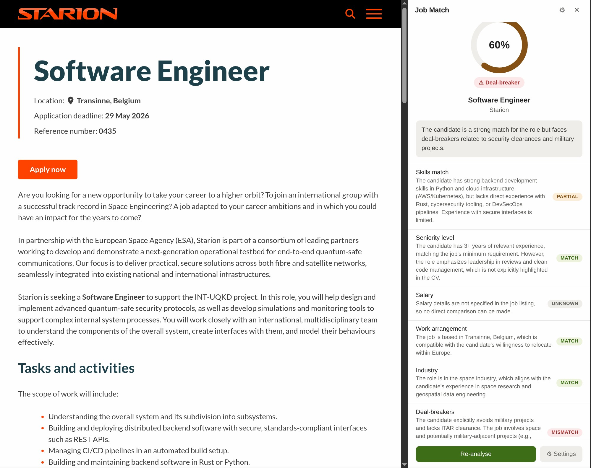
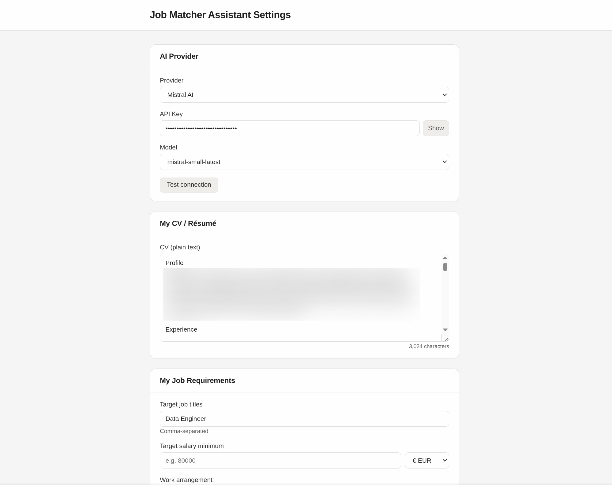

# 🎯 Job Matcher Assistant

> **Stop wasting time on jobs that don't fit.** Instantly score any job listing against your CV and preferences — right in your browser sidebar.

**Job Matcher Assistant** is a powerful Chrome extension that uses AI to help you find your perfect career match. It automatically detects job listings, extracts the details, and gives you an instant compatibility score based on your unique profile.

---

## 🚀 Key Features

- **⚡ Instant Scoring** — 0–100 match score with a beautiful animated ring indicator.
- **📊 Detailed Breakdown** — Analysis of Skills, Seniority, Salary, Work Arrangement, Industry, and more.
- **🚩 Deal-breaker Alerts** — Immediate visual warnings if a job violates your "non-negotiables".
- **📜 Analysis History** — Keeps track of the last 30 jobs you've looked at, with **history clearing** support.
- **🔍 Smart Detection** — Automatically recognizes job listings on LinkedIn, Indeed, Glassdoor, and many others.
- **📄 CV Import** — Quickly import your profile from PDF or Word files to get set up in seconds.
- **🤖 Multi-Model Support** — Use your favorite AI: Anthropic (Claude), OpenAI (GPT), Google (Gemini), Mistral, or keep it 100% private with local **Ollama** models.
- **🔒 Privacy First** — Your CV and API keys are stored locally. Data is only sent to the AI provider you choose.

---

## 📸 Screenshots

### Analysis View

### Settings & Configuration

---

## 🛠️ Supported AI Providers

| Provider | Recommended Models                                                                    |
| :--- |---------------------------------------------------------------------------------------|
| **Anthropic** | `claude-opus-4-7`, `claude-sonnet-4-6`, `claude-sonnet-4.5`, `claude-haiku-4-5`       |
| **OpenAI** | `gpt-5.5`, `gpt-5.5-pro`, `gpt-5.5-mini`, `gpt-5.4-mini`, `gpt-4.1`                   |
| **Google Gemini** | `gemini-3.5-flash`, `gemini-3.1-flash`, `gemini-3.1-pro`, `gemini-2.5-pro`            |
| **Mistral AI** | `mistral-small-latest`, `mistral-large-latest`                                        |
| **Ollama (Local)** | `llama3.1`, `mistral`, `phi3` (Populated from your local library)                     |

---

## 📥 Installation

1. Clone or download this repository.
2. Open Chrome and navigate to `chrome://extensions`.
3. Enable **Developer mode** (toggle in the top-right corner).
4. Click **Load unpacked**.
5. Select the `ai-job-matcher-extension/` directory.
6. **Pin the extension** to your toolbar for easy access!

---

## ⚙️ Configuration

1. **Open Settings**: Click the gear icon in the sidebar or right-click the extension icon → **Options**.
2. **Set your Profile**:
   - **CV**: Paste your CV text or use the **Import CV** button to extract text from a PDF/Docx.
   - **Target Titles & Locations**: Define exactly what roles and where you are looking (e.g., "Remote", "London").
   - **Job Preferences**: Set your desired salary range and work arrangement (Remote/Hybrid/Onsite).
3. **Connect AI**: Add your API key for your preferred provider or point it to your local Ollama instance.
4. **Save**: Press `Ctrl+S` (or `Cmd+S`) to save instantly.

### Where to get API keys?
- [Anthropic Console](https://console.anthropic.com/)
- [OpenAI Platform](https://platform.openai.com/)
- [Google AI Studio](https://aistudio.google.com/)
- [Mistral Console](https://console.mistral.ai/)

---

## 🏠 Running Locally with Ollama

For 100% private, free analysis:
1. Install [Ollama](https://ollama.com).
2. Run a model: `ollama run llama3.1`.
3. In the extension settings, select **Ollama** as the provider.
4. The extension will automatically detect your installed models.

---

## 🏗️ Technical Architecture

- **Content Script**: Stealthily extracts job data and detects listing patterns using weighted heuristics.
- **Background Service Worker**: Manages AI communications, handles session persistence, and coordinates tab synchronization.
- **Side Panel UI**: Built with modern CSS and Vanilla JS for a lightweight, native feel.
- **Provider Layer**: A clean abstraction for interacting with various LLM APIs.

---

## 📝 License

This project is licensed under the MIT License - see the [LICENSE](LICENSE) file for details.

Developed with ❤️ by Etienne Lecrivain.
